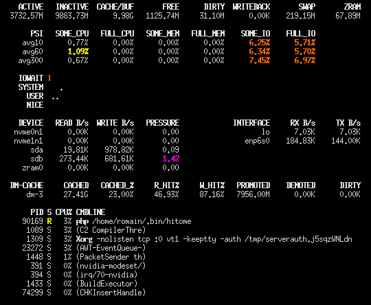

hitome
======

`hitome` is a quick and dirty system monitor that aims to be light on
system resources. It aims to be a lighter version of
[`glances`](https://github.com/nicolargo/glances).

`hitome` only targets Linux as it parses non-portable data from `/proc`.

Released under the Apache License, version 2.0.

Features
========

- Monitors memory usage,
- Swap/Zram usage,
- System pressure information (CPU/Mem/IO),
- Usage of each CPU core,
- Traffic to/from block devices and network interfaces,
- dm-cache/lvmcache devices.

This is not meant to be a full-blown `top/htop` replacement, use these
tools instead if you want more features.

Feature wishlist (merge requests welcome!)
==========================================

- [ ] Move settings in config file (refresh rates, filter regexps, etc.)
- [ ] Dynamic number of process lines based on $(tput lines)
- [ ] Configurable layout
- [ ] Fix free space% on nested partitions/dm layers
- [ ] Even lower resource usage (more efficient string parsing/generation, maybe rewrite to a more suited language?)
- [ ] Multiple instances don't recompute everything, use IPC to show the same data as the first instance

Dependencies
============

* PHP (CLI only)
* Linux kernel
* Optional: sudo, dmsetup (device-mapper) for dm-cache/lvmcache support

Installation
============

* Clone the repository or download the `hitome` file.
* Add this directory to your `$PATH` or copy/symlink `hitome` to `/usr/local/bin`.

* dm-cache/lvmcache support requires adding this to your sudoers file (using `visudo`):
  ~~~
  Cmnd_Alias DMSETUP_STATUS = /usr/bin/dmsetup status /dev/dm-*
  %users ALL=NOPASSWD: DMSETUP_STATUS
  ~~~
  You can replace `%users` by your own username.
